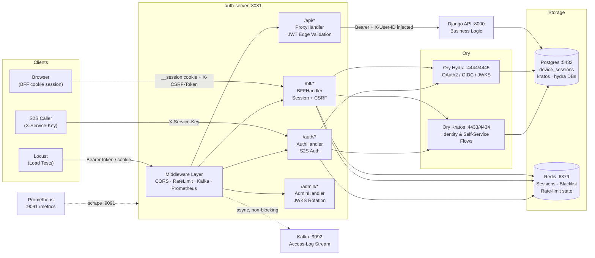
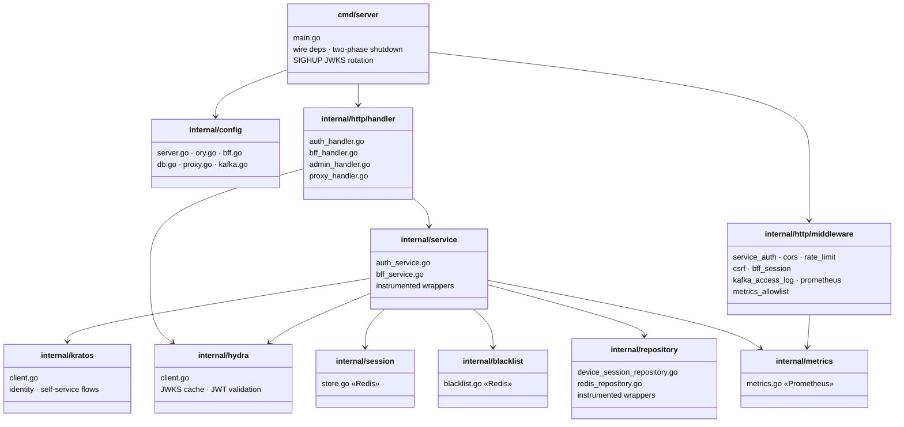

# Central Auth

> **Go-First Authentication Gateway** — BFF session layer, S2S JWT issuer, and edge-validating reverse proxy for the Hackonomics platform.


---

## Table of Contents

1. [Overview](#overview)
2. [Architecture](#architecture)
   - [System Context](#system-context)
   - [Authentication Sequence](#authentication-sequence)
   - [Go Project Layout](#go-project-layout)
3. [Quick Start](#quick-start)
4. [API Reference](#api-reference)
   - [S2S Routes — `/auth/*`](#s2s-routes----auth)
   - [BFF Routes — `/bff/*`](#bff-routes----bff)
   - [Proxied Routes — `/api/*`](#proxied-routes----api)
   - [Admin & Observability](#admin--observability)
5. [Configuration](#configuration)
6. [External Services](#external-services)
7. [Testing](#testing)
8. [Performance](#performance)
9. [Security Hardening](#security-hardening)

---

## Overview

Central Auth is the authentication boundary for the Hackonomics platform. It fulfils three roles simultaneously:

| Role | Mechanism | Consumers |
|------|-----------|-----------|
| **S2S Auth Gateway** | `X-Service-Key` pre-shared key; issues Hydra OAuth2 JWT pairs | Django backend, internal services |
| **Browser BFF** | Opaque `__session` cookie + double-submit CSRF; auto-refreshes Hydra tokens silently | React / Next.js frontend |
| **API Edge Proxy** | Validates Hydra JWTs locally (cached JWKS, zero network round-trip) then reverse-proxies to Django | All `/api/*` traffic |

All three paths share a single Gin router on `:8081`. Prometheus metrics are served on an internal-only port `:9091`.

---

## Architecture

### System Context



### Authentication Sequence

Three phases of the Go-First Gateway handshake — BFF login, a protected BFF call, and a proxied API request.

```mermaid
sequenceDiagram
    autonumber
    participant Browser
    participant GW as auth-server
    participant Hydra as Ory Hydra
    participant Kratos as Ory Kratos
    participant Redis
    participant PG as Postgres

    Note over Browser,PG: Phase 1 — BFF Login  POST /bff/login
    Browser->>GW: POST /bff/login {email, password}
    GW->>Kratos: submitLoginFlow(identifier, password)
    Kratos-->>GW: kratosSessionToken
    GW->>Hydra: client_credentials → access_token + refresh_token
    GW->>Redis: SET session:{hex64} {kratosID, tokens, deviceID, TTL=168h}
    GW->>PG: SaveDeviceSession(kratosID, deviceID, userAgent, IP)
    GW-->>Browser: "200 OK · Set-Cookie: __session=<hex64>; HttpOnly; Secure; SameSite=Lax · X-CSRF-Token: <hmac>"

    Note over Browser,PG: Phase 2 — Protected BFF Call  POST /bff/logout
    Browser->>GW: POST /bff/logout · Cookie: __session=… · X-CSRF-Token: …
    GW->>GW: BFFSessionMiddleware — validate __session (64-char hex)
    GW->>GW: CSRFMiddleware — HMAC verify X-CSRF-Token
    GW->>Redis: GET session:{id} → kratosID + accessToken
    GW->>Hydra: revokeToken(accessToken)
    GW->>Redis: blacklist.Revoke(jti) · DEL session:{id}
    GW->>PG: RevokeDevice(kratosID, deviceID)
    GW-->>Browser: "204 No Content · Set-Cookie: __session=; Max-Age=0"

    Note over Browser,PG: Phase 3 — Proxied API Call  GET /api/dashboard
    Browser->>GW: GET /api/dashboard · Authorization: Bearer <access_token>
    GW->>GW: ProxyHandler — extractBearerToken(header ∥ access_token cookie)
    GW->>GW: Del X-User-ID (spoof prevention)
    GW->>Hydra: ValidateAccessToken — local JWKS verify (cached, 0 RTT hot path)
    GW->>GW: Set X-User-ID: <sub> · Set Authorization: Bearer <token>
    GW->>Django: GET /api/dashboard · Bearer + X-User-ID
    Django-->>GW: 200 JSON
    GW-->>Browser: 200 JSON (proxied)
```

### Go Project Layout



---

## Quick Start

**Prerequisites:** Docker 24+, Docker Compose v2, Go 1.24 (for local dev only)

```bash
# 1. Clone
git clone git@github.com:syjoe02/Central-Auth.git
cd Central-Auth

# 2. Create env file from template
cp env/.env.prod.template env/.env.prod

# Edit env/.env.prod — substitute all ${VAR} placeholders.
# Minimum required for local dev:
#   APP_ENV=development
#   CENTRAL_AUTH_SERVICE_KEY=<any-string-for-dev>
#   BFF_CSRF_SECRET=<openssl rand -base64 32>
#   BFF_COOKIE_DOMAIN=localhost
#   BFF_COOKIE_SECURE=false
#   HYDRA_CLIENT_ID=central-auth-bff
#   HYDRA_CLIENT_SECRET=<any-string-for-dev>
#   DJANGO_URL=http://django:8000

# 3. Bring up the full stack (Redis, Postgres, Kratos, Hydra, auth-server)
docker compose up --build

# 4. Verify
curl http://localhost:8081/health
# {"status":"ok"}
```

> **Shared infrastructure** (Kafka, Prometheus) is expected on the external Docker network `shared-monitor-net`. Start `Hackonomics-Infra` before `auth-server` if you need access-log streaming and metrics scraping.

---

## API Reference

### S2S Routes — `/auth/*`

All routes require `X-Service-Key: <CENTRAL_AUTH_SERVICE_KEY>`.

| Method | Path | Rate Limited | Description |
|--------|------|:---:|-------------|
| `POST` | `/auth/signup` | No | Create a new Kratos identity and return initial token pair |
| `POST` | `/auth/login` | Yes | Exchange credentials for Hydra access + refresh tokens |
| `POST` | `/auth/refresh` | Yes | Exchange a refresh token for a new access token |
| `POST` | `/auth/logout` | No | Revoke the current session's access token |
| `POST` | `/auth/logout-all` | No | Revoke all device sessions for the authenticated identity |
| `POST` | `/auth/verify` | No | Validate a JWT locally (returns 200 + claims on success) |

**Request / Response convention**

```json
// POST /auth/login
// Request
{ "email": "user@example.com", "password": "••••••••" }

// Response 200
{
  "access_token":  "<jwt>",
  "refresh_token": "<opaque>",
  "expires_in":    900
}
```

---

### BFF Routes — `/bff/*`

Browser-facing. Tokens are never exposed to JavaScript — stored server-side in Redis behind an opaque `__session` cookie.

| Method | Path | Auth Required | CSRF | Description |
|--------|------|:---:|:---:|-------------|
| `POST` | `/bff/login` | No | No | Issue `__session` cookie + `X-CSRF-Token` header |
| `POST` | `/bff/logout` | `__session` | Yes | Revoke current session; clear cookie |
| `POST` | `/bff/logout-all` | `__session` | Yes | Revoke all device sessions for the identity |
| `GET` | `/bff/whoami` | `__session` | Yes | Return `{ kratosID, deviceID }` for the current session |

**Cookie properties**

| Cookie | `HttpOnly` | `Secure` | `SameSite` | TTL |
|--------|:---:|:---:|:---:|-----|
| `__session` | Yes | `BFF_COOKIE_SECURE` | Lax | `BFF_SESSION_TTL` (default 168 h) |

CSRF tokens use **double-submit + HMAC binding** (`BFF_CSRF_SECRET`). The token is rotated on every response and must be echoed in the `X-CSRF-Token` request header.

---

### Proxied Routes — `/api/*`

All `/api/*` traffic is reverse-proxied to `DJANGO_URL` after edge-validation. No BFF session is required — only a valid Hydra access token.

| Path pattern | Token required | How token is read | Forwarded headers |
|---|:---:|---|---|
| `/api/auth/*` | No | — | Raw request forwarded as-is |
| `/api/**` (all other) | Yes | `Authorization: Bearer` header **or** `access_token` httpOnly cookie | `Authorization: Bearer <token>`, `X-User-ID: <sub>` |

The `X-User-ID` header is **always stripped** from incoming requests before validation and is only re-injected by this gateway after a successful JWT verification. Django must never trust a client-supplied `X-User-ID`.

---

### Admin & Observability

| Method | Path | Auth | Description |
|--------|------|------|-------------|
| `GET` | `/health` | None | Liveness probe — returns `{"status":"ok"}` |
| `POST` | `/admin/jwks/refresh` | `X-Service-Key` | Force immediate JWKS cache reload from Hydra |
| `GET` | `/metrics` | IP CIDR + HTTP Basic Auth | Prometheus metrics (port `9091`, internal only) |

Send `SIGHUP` to trigger a zero-downtime JWKS rotation without restarting the server:

```bash
docker kill --signal=HUP central-auth-server
```

---

## Configuration

Copy `env/.env.prod.template` → `env/.env.prod` and fill in all `${VAR}` placeholders.

### Server & Routing

| Variable | Required | Default | Description |
|----------|:---:|---------|-------------|
| `APP_ENV` | Yes | — | `production` enables strict validation of all secrets |
| `CENTRAL_AUTH_SERVICE_KEY` | Yes | — | Pre-shared key for `X-Service-Key` auth (≥ 32 chars in prod) |
| `TRUSTED_PROXY_CIDRS` | No | `172.16.0.0/12` | Comma-separated CIDRs for upstream proxies (prevents XFF spoofing) |
| `RATE_LIMIT_REQUESTS_PER_MIN` | No | `20` | Per-IP rate limit; set `0` to disable (e.g. for load testing) |

### CORS

| Variable | Required | Default | Description |
|----------|:---:|---------|-------------|
| `CORS_ALLOWED_ORIGINS` | Yes (prod) | — | Comma-separated exact-match origin allowlist; wildcard denied in production |

### BFF Session Layer

| Variable | Required | Default | Description |
|----------|:---:|---------|-------------|
| `BFF_CSRF_SECRET` | Yes | — | HMAC secret for CSRF token binding (≥ 32 bytes recommended) |
| `BFF_COOKIE_DOMAIN` | Yes | — | Domain attribute for `__session` cookie |
| `BFF_COOKIE_SECURE` | Yes | `true` | Set `false` only in local HTTP dev |
| `BFF_SESSION_TTL` | No | `168h` | Server-side session lifetime (Redis TTL) |
| `BFF_JWKS_GRACE_PERIOD` | No | `30m` | Grace period during JWKS key rotation (max `2h`) |
| `BFF_ACCESS_TOKEN_REFRESH_BUFFER` | No | `60s` | Pre-expiry buffer for proactive token refresh |

### Ory Kratos

| Variable | Required | Default | Description |
|----------|:---:|---------|-------------|
| `KRATOS_PUBLIC_URL` | Yes | — | Kratos public API (e.g. `http://kratos:4433`) |
| `KRATOS_ADMIN_URL` | Yes | — | Kratos admin API (e.g. `http://kratos:4434`) |
| `KRATOS_COOKIE_SECRET` | Yes | — | Secret for Kratos session cookies |
| `KRATOS_CIPHER_SECRET` | Yes | — | Secret for Kratos encryption at rest |

### Ory Hydra

| Variable | Required | Default | Description |
|----------|:---:|---------|-------------|
| `HYDRA_PUBLIC_URL` | Yes | — | Hydra public API (e.g. `http://hydra:4444`) |
| `HYDRA_ADMIN_URL` | Yes | — | Hydra admin API (e.g. `http://hydra:4445`) |
| `HYDRA_CLIENT_ID` | Yes | — | OAuth2 client ID registered in Hydra |
| `HYDRA_CLIENT_SECRET` | Yes | — | OAuth2 client secret |
| `HYDRA_REDIRECT_URI` | No | `http://auth-server:8081/internal/oauth/callback` | OAuth2 redirect URI |
| `HYDRA_SYSTEM_SECRET` | Yes | — | Hydra system secret for signing/encryption |
| `HYDRA_JWT_AUDIENCE` | No | `HYDRA_CLIENT_ID` | Expected `aud` claim; tokens with mismatched audience are rejected |

### Google OIDC (Kratos provider)

| Variable | Required | Default | Description |
|----------|:---:|---------|-------------|
| `GOOGLE_CLIENT_ID` | Yes (if OIDC enabled) | — | Google OAuth2 client ID |
| `GOOGLE_CLIENT_SECRET` | Yes (if OIDC enabled) | — | Google OAuth2 client secret |

### PostgreSQL

| Variable | Required | Default | Description |
|----------|:---:|---------|-------------|
| `POSTGRES_HOST` | No | `localhost` | Database host |
| `POSTGRES_PORT` | No | `5432` | Database port |
| `POSTGRES_USER` | Yes | — | Database user |
| `POSTGRES_PASSWORD` | Yes | — | Database password (≥ 12 chars in prod) |
| `POSTGRES_DB` | No | `central_auth` | Database name |
| `POSTGRES_SSLMODE` | No | `require` | SSL mode (`require` / `verify-full`) |
| `POSTGRES_POOL_MAX_CONNS` | No | `25` | Max connections in pgxpool |
| `POSTGRES_POOL_MIN_CONNS` | No | `5` | Min connections in pgxpool |

### Redis

| Variable | Required | Default | Description |
|----------|:---:|---------|-------------|
| `REDIS_ADDR` | No | `localhost:6379` | Redis address (`host:port`) |

### Kafka (Access-Log Streaming)

| Variable | Required | Default | Description |
|----------|:---:|---------|-------------|
| `KAFKA_BROKERS` | No | `kafka:9092` | Comma-separated broker list |
| `KAFKA_TOPIC` | No | `access-logs` | Topic for access-log events |
| `KAFKA_CHANNEL_SIZE` | No | `4096` | Internal producer buffer depth (clamped to [64, 65536]) |
| `IS_PRODUCTION` | No | `false` | Fatal on broker failure when `true` |

### Metrics & Monitoring

| Variable | Required | Default | Description |
|----------|:---:|---------|-------------|
| `METRICS_ALLOWED_CIDR` | Yes (prod) | — | Comma-separated CIDRs allowed to scrape `:9091/metrics` |
| `METRICS_BASIC_AUTH_USER` | Yes (prod) | — | HTTP Basic Auth username for `/metrics` |
| `METRICS_BASIC_AUTH_PASSWORD` | Yes (prod) | — | HTTP Basic Auth password for `/metrics` |

### Django Proxy

| Variable | Required | Default | Description |
|----------|:---:|---------|-------------|
| `DJANGO_URL` | Yes | — | Full base URL of the Django backend (e.g. `http://django:8000`) |

---

## External Services

| Service | Image | Port(s) | Network | Role |
|---------|-------|---------|---------|------|
| `redis` | `redis:7-alpine` | 6379 | default | BFF sessions, token blacklist, rate-limit buckets |
| `postgres` | `postgres:16-alpine` | 5432 | default, shared-monitor-net | `device_sessions` table; Kratos & Hydra databases |
| `kratos` | `oryd/kratos:v1.3.0` | 4433 (pub), 4434 (admin) | default | Identity management, self-service login/registration/recovery |
| `hydra` | `oryd/hydra:v2.3.0` | 4444 (pub), 4445 (admin) | default | OAuth2/OIDC token issuer; JWKS endpoint |
| `kratos-migrate` | `oryd/kratos:v1.3.0` | — | — | One-shot schema migration |
| `hydra-migrate` | `oryd/hydra:v2.3.0` | — | — | One-shot schema migration |
| `hydra-client-init` | `oryd/hydra:v2.3.0` | — | — | Registers the `central-auth-bff` OAuth2 client on first start |
| `kafka` *(external)* | Hackonomics-Infra | 9092 | shared-monitor-net | Access-log streaming |

The `shared-monitor-net` Docker network is owned by the **Hackonomics-Infra** stack. Ensure that stack is running before starting `auth-server` if Kafka and Prometheus scraping are required.

---

## Testing

```bash
# Run all tests with race detector
go test -race ./...

# Run with coverage report
go test -race -cover ./...

# Run a single package
go test -race -v ./internal/service/...
```

**Current coverage by package**

| Package | Coverage | Notes |
|---------|:---:|-------|
| `internal/blacklist` | 85.0% | Redis blacklist revoke / check |
| `internal/session` | 79.3% | Redis session store |
| `internal/service` | 62.2% | Auth + BFF service logic |
| `internal/http/handler` | 22.5% | BFF handler endpoints |
| `internal/hydra` | 14.9% | JWKS caching, JWT validation |

Tests use [miniredis](https://github.com/alicebob/miniredis) for Redis and [go.uber.org/mock](https://github.com/uber-go/mock) for interface mocking — no live infrastructure required.

---

## Performance

**Go-First JWT validation** eliminates the network round-trip to Hydra's introspection endpoint on every authenticated request. Hydra JWTs are verified locally against a cached JWKS set that is refreshed lazily (or on `SIGHUP` for zero-downtime key rotation).

| Approach | Hot-path latency | Network calls per request |
|----------|:---:|:---:|
| Hydra introspection (old) | ~15 ms | 1 (Hydra round-trip) |
| Local JWKS verify (current) | < 1 ms | 0 (cache hit) |

The in-process rate limiter uses `sync.Map` with a background eviction goroutine, keeping memory growth bounded even under port-scan traffic (stale buckets swept every 5 minutes).

Kafka access-log publishing is fully asynchronous — the HTTP response is sent before the log event is written, so a slow or unavailable broker has zero impact on request latency. Dropped events are counted in the `central_auth_kafka_events_dropped_total` Prometheus counter.

---

## Security Hardening

The following findings from the pre-merge security review are resolved in the current codebase:

| ID | Severity | Finding | Status |
|----|:---:|---------|--------|
| C-1 | Critical | Compiled `server` binary not excluded from git | Fixed — `/server` added to `.gitignore` |
| H-2 | High | `X-User-ID` not stripped on auth-free proxy paths | Fixed — `Header.Del("X-User-ID")` before any auth check in `ProxyHandler` |
| M-2 | Medium | `c.ClientIP()` trusted without proxy CIDR config (XFF spoofing) | Fixed — `r.SetTrustedProxies(serverConfig.TrustedProxyCIDRs)` in `main.go` |

Tracked / acknowledged findings (dev environment only — must be resolved before production deploy):

| ID | Severity | Finding | Action required |
|----|:---:|---------|-----------------|
| H-1 | High | `DJANGO_URL` scheme not validated (SSRF from env misconfiguration) | Add scheme + host allowlist in `LoadProxyConfig()` |
| H-3 | High | Kratos/Hydra DSNs use `sslmode=disable` in docker-compose | Change to `sslmode=require` for production compose file |
| H-4 | High | Kratos and Hydra started with `--dev` flag | Remove `--dev` and configure explicitly for production |
| M-1 | Medium | Kratos CORS `allowed_origins: ["*"]` | Restrict to explicit origin list before production |
| M-3 | Medium | `changeme` OAuth placeholder in `kratos/kratos.yml` | Replace with `INJECTED_VIA_ENV` sentinel to fail fast on misconfiguration |
